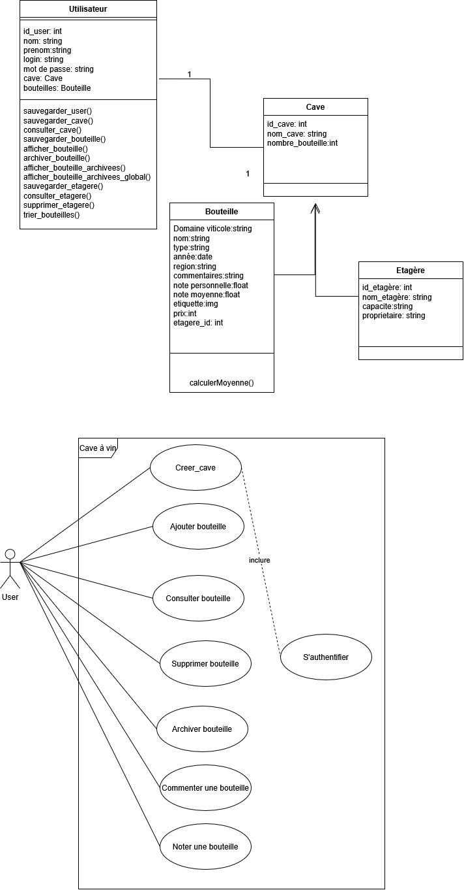
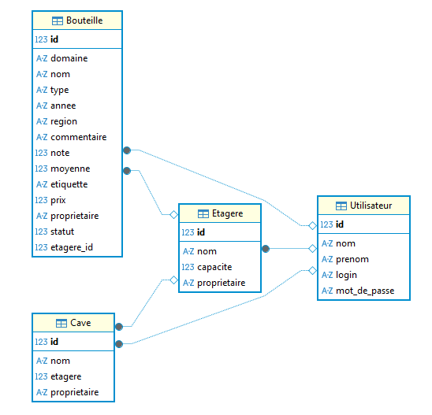
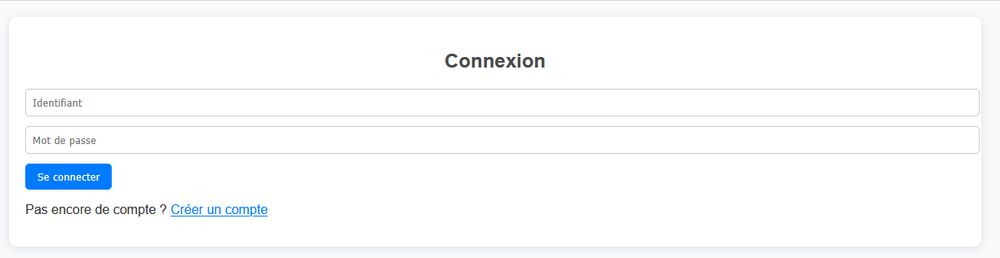
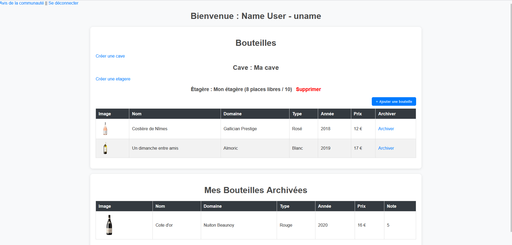
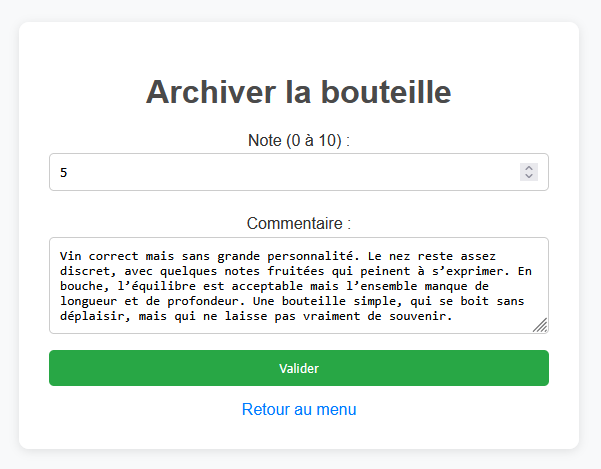
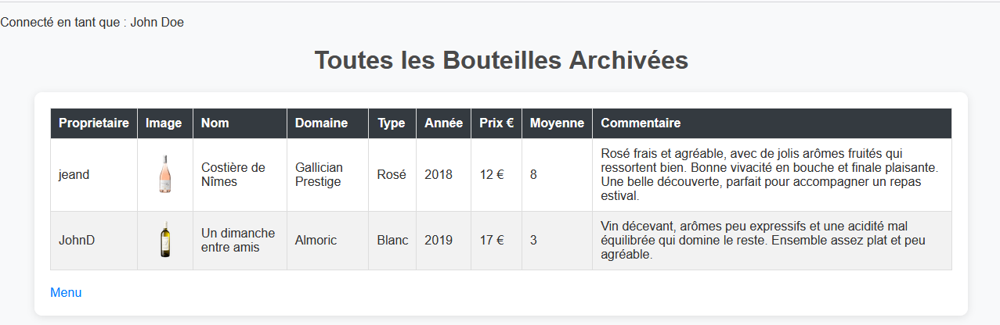

# ETRS711 – Mini Projet Evalué
## Conception et Programmation Orientée Objet d’une application web
### Application pour la gestion d’une cave à vin
Vous devez concevoir (UML) et implémenter (Python) une application web multi utilisateurs accessible
qui permet à des propriétaires de caves amateurs de vin de gérer leurs bouteilles.
Chaque utilisateur peut créer une cave virtuelle qui représente sa cave réelle. Une cave contient un
nombre de bouteilles et se compose d’étagères. Chaque étagère est identifiée par un nom et peut
comporter un nombre limité mais paramétrable de bouteilles.

Chaque bouteille de vin se caractérise par :
- Domaine viticole (ex : Château Montelena)
- Nom (ex : Cabernet Sauvignon)
- Type (ex : Vin Rouge)
- Année (ex : 1967)
- Région (ex : Bourgogne)
- Commentaires
- Note personnelle (ex : 16/20)
- Note moyenne de la communauté (ex : 12/20)
- Photo de l’étiquette
- Prix (ex : 67€)

Attention, un utilisateur peut avoir plusieurs bouteilles identiques !
Quand il sort une bouteille de sa cave, il peut soit la supprimer de la cave virtuelle, soit l’archiver avec
une note. Si la bouteille fait partie d’un lot identique, la bouteille doit être soustraite du lot restant.

Un utilisateur identifié doit pouvoir ajouter, supprimer (ou archiver), afficher chaque bouteille, les trier
sur chacune des caractéristiques des bouteilles.
Les commentaires et les notes de chaque bouteille sont visibles par tous les utilisateurs de l’application.

La note moyenne est calculée avec l’ensemble des notes disponibles pour une bouteille de même
caractéristique.
Organisation

- Vous devez mettre en œuvre les outils et concepts étudiés durant les séances de TD de ce module :
UML, Python Objet, Base de données, Framework Web.
Vous disposez de 4 séances de 4h. C’est relativement conséquent et doit vous permettre de réaliser
une solution aboutie sans travail supplémentaire en dehors des séances. Dans le cadre de ce module,
il n’est pas nécessaire de déployer votre application sur un serveur externe à la salle de TP.

- Le code commenté de l’application, la documentation (diagrammes UML compris) seront accessibles
via une forge logicielle (GitHub, GitLab, …)

## Documentation de l'application:

### Diagrammes UML:

### Schéma de la base de donées

### Fonctionnement de l'application:
1. Executer le programme web.py
2. Se rendre sur l'url: http://127.0.0.1:5080

Si vous n'avez jamais utilisé l'application, vous devez d'abord crééer un compte:

Une fois connecté, vous arriverez sur la page principales ou vous pourrez crééer une cave, des étagères, des bouteilles... Vous aurez aussi la possibilité d'archiver une bouteille pour lui attribuer une note et un commentaire.

En cliquant sur "Archiver", vous pourrez noter et commenter la bouteille:

Enfin, en allant sur "avis de la communauté" (En haut à gauche de la page principale), vous verrez les notes et les commentaires attribués par d'autres utilisateurs:

Bonne Dégustation !
